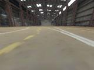
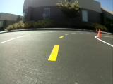
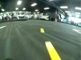
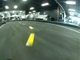
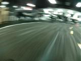

# Donkey Car Datasets
**_Note_:** All tub data is in donkey 4.X format.

# The large dataset
This is the place for donkey datasets. The large dataset that was originally 
uploaded by Tawn is in the folder `large_dataset`. Here are some example images:

 

# The circuit launch dataset
Recorded by Ed for the next races. We have trained a bunch of pilots on that 
data. Please get in touch if you have more tub data for this course, so 
we can create more robust pilots by combining those datasets in training. 

Here are some example images:

